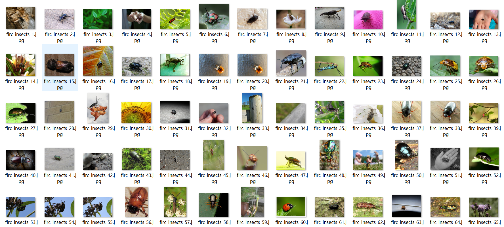
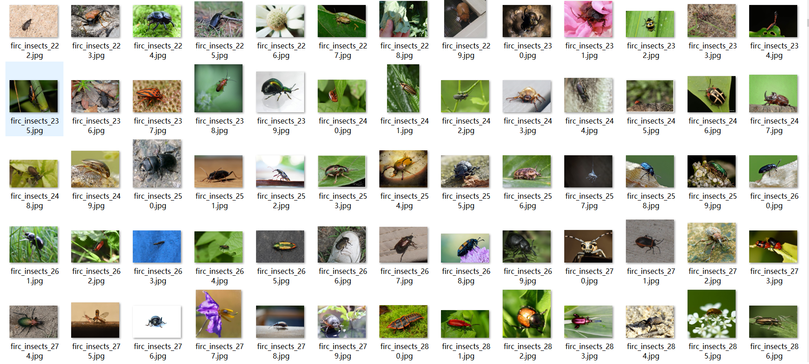

# [Object Detection Dataset] （Insect Detection ）Crops Pest Detection Dataset VOC+YOLO format3575 images10-class

Dataset Description: ~

【Target Detection Dataset】Crop Pest Detection Dataset VOC+YOLO-formatted with 3575 images of 10 classes

Insects include ['Cockroaches', 'Grasshoppers', 'Mango Leafhoppers', 'Mango Psyllids', 'Moths', 'Wireworms', 'Mites', 'Sucking Insects', 'Wasps', 'Bats']

Number of categories: 10

Annotation class names: ["bitichong","feie ","huangchong","huangfeng","jiachong","juying","mangguofenjie","mangguoliaodou","xiangbichong","zuanxinchong"]

Number of boxes labeled in each category:

bitichong frame count = 392

feie frame count = 495

huangchong frame count = 490

huangfeng frame count = 496

jiachong frame count = 437

juying frame count = 268

mangguofenjie frame count = 282

mangguoliaodou frame count = 185

xiangbichong frame count = 466

zuanxinchong frame count = 266

Total boxes: 3777

Use the labeling tool: labelImg

## Images

---

Here is a pay link on Stripe (https://buy.stripe.com/3cs8yP7sY87d0vu9AB). Please contact me lonlonago@foxmail.com after funding $89, and I will send you a complete data files, thank you!

